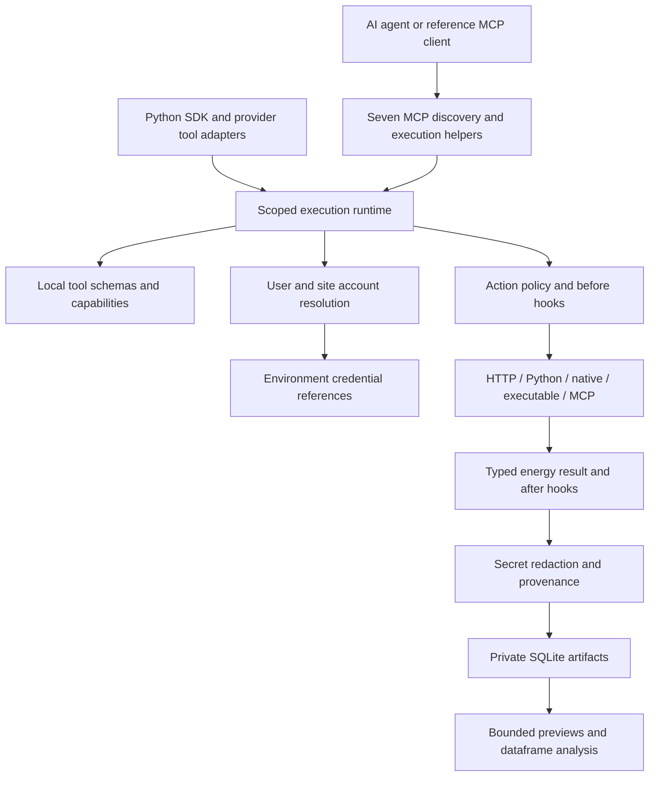

# Architecture

Energy Agent Tools owns its registry, sessions, connection resolution, execution,
MCP service and workbench. No Composio service is involved.

## Contracts

`EnergyAgent.session(user_id, site_id=...)` creates local execution scope. A
session can allow specific toolkits, pin accounts and enable action categories.
An explicit empty toolkit set exposes no connector actions. User identity comes
from trusted host configuration, never a tool argument. One MCP process serves
one operator-configured user/site context. Multi-user applications create
separate scoped sessions through the SDK and must authenticate their own users.

`Toolkit` records runtime, status and auth requirements. `Tool` records JSON
Schema, provider-independent capability names, action categories and idempotency.
`Registry.add(tool, handler)` binds an async handler to a schema. Search is bounded
lexical ranking with inverse-frequency weighting and energy synonyms; it is not an embedding service. An agent can
search again or request an exact tool schema when initial terms miss a match.

Execution is one pipeline for every runtime. Validate scope, enforce action
policy, validate arguments, run before hooks, validate modified arguments,
resolve account and inject credentials, execute handler, run after hooks,
validate output, redact known credentials, append execution provenance and
compact/persist output. Batches are ordered and return independent failures.
There are no automatic retries that could duplicate actions.

Connections belong to a user and optionally a site. Assets belong to sites.
Selecting an account validates user, toolkit, site and enabled state. Ambiguous
accounts cause a structured error rather than arbitrary selection. A site's
IANA timezone is available to agents for local date windows, including DST.
Private settings and environment variable names do not enter connection lists.

The default policy allows read-only, external-data, calculation and simulation.
Configuration writes, physical control and safety-critical operations require
explicit operator changes in the SDK. There are no physical-control connectors
in the shipped catalogue. Unreviewed MCP actions must not acquire permissions
from an upstream server's read-only annotation.

## Results and workbench

`EnergyResult` requires a measurement kind, unit and source. Optional fields carry
resolution, quality, assumptions, warnings and provenance. Row timestamps retain
offsets; provider-specific heterogeneous series also preserve per-row kinds and
units. A grid carbon estimate is not an electricity meter reading.

SQLite stores serialized result envelopes under random artifact IDs, with user
and session ownership. Results above 16 KB become artifact references with a
three-row preview. A result above 20 MB is rejected. Explicit `persist=true`
also stores small datasets. Analysis returns calculated results linked to input
artifacts and kinds; it cannot relabel a simulation as metered data.

Supported operations are numeric summaries, bounded resampling, UTC timestamp
joins, weather pivots and anomaly screening. Empty resample bins remain null. Duplicate join
timestamps must be resolved first. Units on both sides of joins remain in
provenance. The trusted Python SDK `Workbench.calculate` accepts a dataframe
callable for local analysis. Agents cannot submit arbitrary Python through MCP.
This is a private local workbench, not a security sandbox for untrusted code.

## Interfaces

MCP exposes search, exact schema retrieval, safe connection list/selection,
ordered batch execution, toolkit listing, skill guidance and site context.
Both stdio and loopback streamable HTTP use the official MCP Python SDK.
OpenAI Chat, OpenAI Responses and Anthropic adapters preserve JSON Schema and
optionality. OpenAI strict mode is disabled rather than silently narrowing
unsupported schemas. Applications route returned calls to the same MCP/SDK
execution methods.

Connector integration is operator controlled. HTTP handlers own fixed public
origins or locally configured telemetry origins. Library handlers own model
construction. Executable adapters own fixed argv and JSON stdin/stdout. MCP
adapters import schemas from local stdio or remote streamable HTTP. Imported
semantics and action permissions require explicit review.
