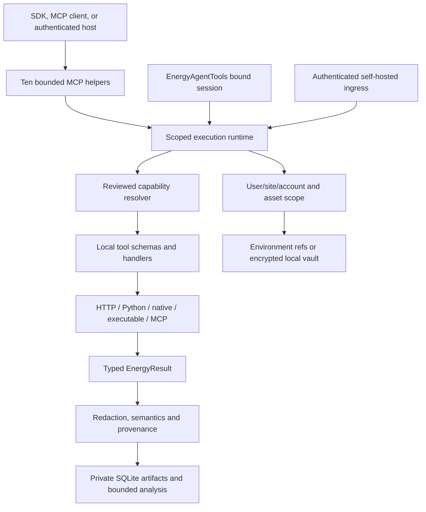

# Architecture

Energy Agent Tools owns the registry, capability bindings, sessions,
connections, execution policy, MCP service and local workbench. It does not
depend on a hosted connector or orchestration service.



## Startup and sessions

`build_agent(root, config)` registers the built-in connector families, optional
plugins, and an operator-approved CSV root. Configuration can also describe
sites, extensible assets, accounts, bindings, a local encrypted vault and MCP
servers. MCP imports are asynchronous: call `await configure_mcp(agent,
config)` after `build_agent` and before resolving bindings. The CLI performs
this step for configured `mcp_servers`.

The bound SDK follows the same lifecycle:

```python
from energy_agent_tools import EnergyAgentTools

async with EnergyAgentTools(".energy-agent", config) as tools:
    home = tools.session("user-1", "home")
    provider_tools = await home.tools("openai-responses")
    matches = home.resolve("get_energy_consumption", kind="metered", unit="kWh")
```

`EnergyAgentTools.initialize()` is the explicit equivalent of the async
context manager. `session(user_id, site_id=...)` then creates a bound session;
it does not authenticate a user by itself. Applications that use the SDK
outside the authenticated host must establish user identity and pass only
their own scoped sessions. A process started by the simple `serve` command
uses one configured identity. The `host` command adds authenticated
multi-user ingress.

## Contracts and capability resolution

`Toolkit` records runtime, status, version and credential requirements. `Tool`
records its JSON Schema, capability IDs, action categories, idempotency,
version, review state and optional result kind/unit. `Registry.add(tool,
handler)` validates the schema and binds one async handler.

Capability labels are search and binding keys, not interchangeable provider
schemas. A `CapabilityBinding` names the exact tool and can constrain account,
asset, measurement kind, unit, resolution, coverage interval, quality,
argument defaults/mapping, fixed semantic selectors, preference, review state and binding version.
`CapabilityResolver` filters candidates by session toolkit and site scope,
asset/account compatibility, optional dependency availability, provider
status, connection state and credential availability. It then checks requested
kind, unit, resolution, coverage and the exact tool schema. It returns ranked
candidates with reasons; a tie remains `ambiguous` and requires an explicit
tool or account choice. Execution is allowed only for one available reviewed
binding and passes its expected kind, unit, resolution, asset and fixed arguments into the normal runtime.

The resolver does not translate unlike provider schemas by label. For example,
a cumulative counter is not interval consumption, and power is not energy
without a time basis. Connector-specific argument mappings belong in reviewed
bindings.

## Common execution and safety boundary

Every connector uses one pipeline: validate user/site/toolkit scope, enforce
action policy, validate arguments, run before hooks, validate transformed
arguments, resolve the account, obtain a credential only at the connector
boundary, execute, check reviewed semantics, run after hooks, recheck kind/unit/resolution,
bound scope and original evidence, then redact the current user's known secrets,
append execution and input provenance, then
compact or persist the result. Ordered batches return independent failures and
are bounded to twenty calls. The runtime does not retry actions automatically.

The default session policy permits read-only, external-data, calculation and
simulation actions. Configuration writes, physical control and safety-critical
actions require explicit operator policy. No shipped connector performs
physical control. Imported MCP annotations and executable output cannot grant
permissions or turn derived data into metered data.

`EnergyResult` requires a data kind, unit and source. It can carry provider,
site, asset, timezone, resolution, time bounds, original unit, field units,
quality, assumptions, warnings and provenance. Derived results retain input
artifact IDs, kinds, units and source lineage. Hooks cannot relabel derived
output as metered, change bound scope, or remove original provenance.

## Workbench and artifacts

The workbench stores result envelopes in a private, permission-restricted
SQLite database owned by user and session. It applies retention, per-user and
global quotas, a 20 MB result limit, bounded previews and artifact hashes.
Large results become references; reads and deletes require the same user and
session scope.

Native workbench tools support summaries, robust anomaly screening, DST-aware
resampling, exact UTC joins, long-to-wide pivots and a bounded energy operation
layer for filtering, missing-interval checks, cumulative-counter conversion,
power integration, tariff cost, carbon, baselines, calendar comparisons,
normalization and alignment. Unit checks, duplicate detection, explicit
offsets and lineage remain part of each operation. `Workbench.calculate` is a
trusted local Python API; arbitrary code is not accepted through MCP.

## Interfaces

The MCP server exposes ten bounded helpers:

- `ENERGY_SEARCH_TOOLS`
- `ENERGY_GET_TOOL`
- `ENERGY_MANAGE_CONNECTIONS`
- `ENERGY_MULTI_EXECUTE_TOOL`
- `ENERGY_LIST_TOOLKITS`
- `ENERGY_LIST_SKILLS`
- `ENERGY_SITE_CONTEXT`
- `ENERGY_RESOLVE_CAPABILITY`
- `ENERGY_EXECUTE_CAPABILITY`
- `ENERGY_RUN_SKILL`

Search is deterministic indexed lexical ranking with energy synonyms and
availability signals. It is not an embedding service. Provider adapters format
the same helper schemas for OpenAI Chat, OpenAI Responses and Anthropic; they
preserve optionality and keep original schemas when strict conversion would be
lossy. `BoundSession.dispatch` maps provider aliases back to canonical helper
names before invoking the same MCP server.

`create_server` is a fixed-session loopback service. `create_host` adds bearer
token-digest principals, per-user/site session admission, session and artifact
ownership checks, request/body/session limits, rate limiting and REST plus MCP
routes. Host configuration must provide authenticated principals and allowed
site IDs; it is not an identity provider.

Connections are selected by user, toolkit, site and account ID. `AuthStore`
keeps encrypted credential blobs in a local SQLite vault protected by an
operator-provided Fernet key, returns metadata without tokens, and supports
configure, verify, refresh, disable, revoke, reconnect and OAuth authorization
callback flows. Environment references remain supported for local deployments.

## Connector boundaries and extension points

HTTP handlers own fixed provider origins or an operator-configured origin and
must validate payloads, preserve provider units and kinds, bound rows/pages and
reject cross-origin credential forwarding. Local solver handlers construct
bounded models from explicit JSON and report library/version assumptions.
Executable adapters own fixed argv, restricted environments and bounded
JSON stdin/stdout. MCP adapters use the official client for local stdio or
remote streamable HTTP, inspect and hash upstream schemas, require explicit
review metadata, and re-check the selected schema before each call.

Connector plugins register an entry point in the
`energy_agent_tools.connectors` group. `energy-agent scaffold` creates a
starter module, `energy-agent validate` performs structural schema/handler
validation, and contributor tests must add malformed-input, availability,
credential and meaningful numerical or protocol assertions. These tools are
qualification gates, not claims that a provider is live or production-ready.
